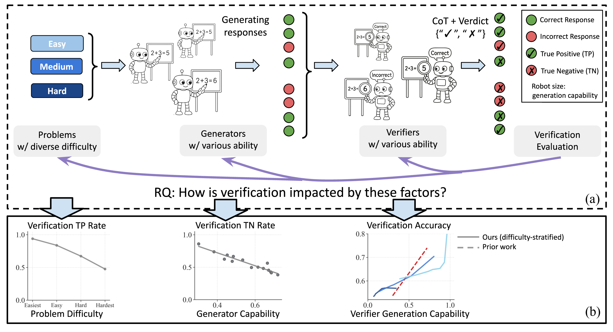

# Variation in Verification: Understanding Verification Dynamics in Large Language Models

[](https://arxiv.org/abs/2509.17995)
[](https://huggingface.co/collections/YefanZhou98/llm-verification-dynamics)

This is the codebase for Variation in Verification: Understanding Verification Dynamics in Large Language Models

## Overview
<p align="center">
  
</p>

In this paper, we study generative verifiers, which perform verification by generating chain-of-thought (CoT) reasoning followed by a binary verdict. We systematically analyze verification dynamics across three dimensions – problem difficulty, generator capability, and verifier generation capability – with empirical studies on 12 benchmarks across mathematical reasoning, knowledge, and natural language reasoning tasks using 14 open-source models (2B to 72B parameter range) and GPT-4o. Our experiments reveal three key findings about verification effectiveness: (1) Easy problems allow verifiers to more reliably certify correct responses; (2) Weak generators produce errors that are easier to detect than strong generators; (3) Verification ability is generally correlated with the verifier’s own problem-solving capability, but this relationship varies with problem difficulty.

## Update
- [x] Add the verification code
- [x] Published the generator and verifier inference results and released the visualization code


## Installation

```bash
# Clone the repository
git clone https://github.com/your-username/llm-verify-dynamics.git
cd llm-verify-dynamics
conda create --name llm-verify python=3.10.16 -y
conda activate llm-verify
pip install uv
uv pip install torch==2.5.1
uv pip install -r requirements.txt

# Set up your HuggingFace token for model access
export BASE_PATH="/path/to/your/project"
export HF_TOKEN=your_huggingface_token_here
export OPENAI_API_KEY=your_openai_api_key_here
export TOGETHER_API_KEY=your_toge_api_key_here
```

## Verification results
### 1. Download preprocessed evaluation data (CoT)
We provided the generator candidate solutions and verification results in [huggingface dataset](https://huggingface.co/collections/YefanZhou98/llm-verification-dynamics).


### 2. Run evaluation from scratch
```bash
# View help and all parameters
bash serve_eval_verifier.sh
# Single model evaluation using local vLLM
bash examples/single_model_local.sh
# Or use API providers (OpenAI/Together)
bash examples/api_provider.sh
```
See the [`examples/`](examples/) directory for more details. Modify the scripts to customize models, datasets, and evaluation parameters.


## Visualization 
### 1. RQ1 Problem difficulty influences the TPR
See the [`visualization/rq1.ipynb`](visualization/rq1.ipynb)
